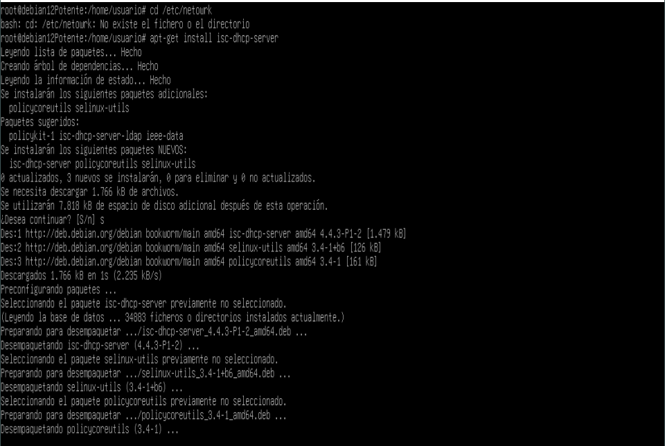
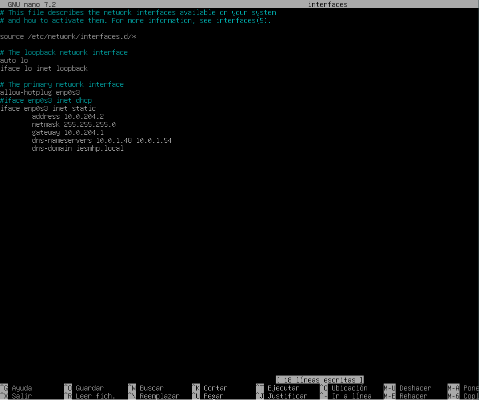
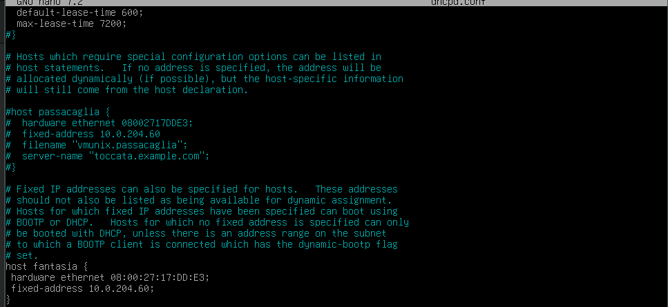
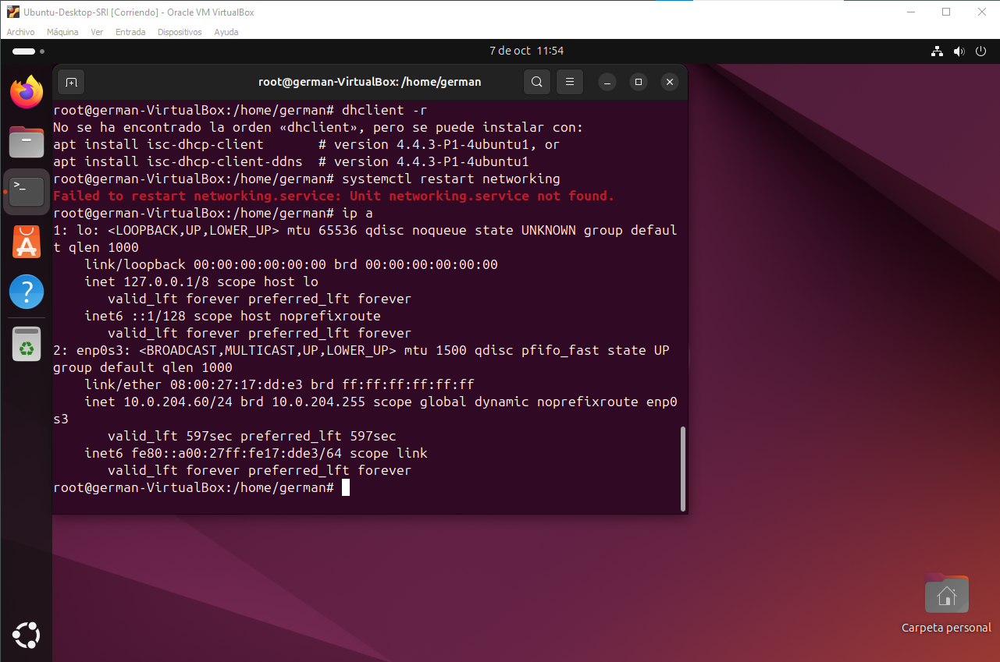
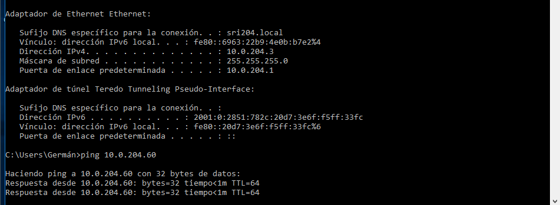

# Tarea 2  
  

Aqui empezamos a instalar el servidor dhcp.  

 Aqui emepezamos a configurar el archivo dhcpd.conf  
 
 En esta imagen configuramos la red de la maquina debian.  
  
 En esta imagen se pude  oserbar que  la reserva de ip para la maquina ubuntu  
   
 En esta imagen  se puede ver la comprobacion de  que la ip reservada ha sido asignada  
 
 Por ultimo se puede observar que las dos maquinas se ven a traves de un ping
